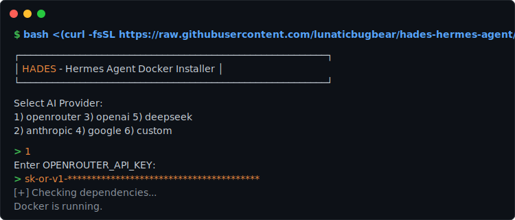
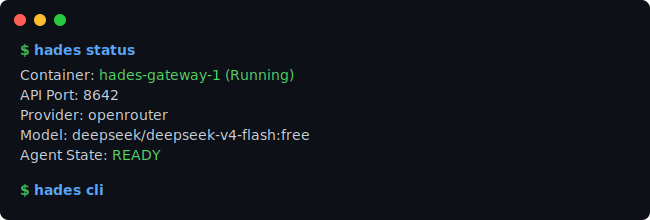

<div align="center">
<br>

# HADES

### Hermes Agent Docker Environment Script

**Run a stateful AI coding agent on any machine in one command.**

<br>

<a href="https://github.com/lunaticbugbear/hades-hermes-agent/actions/workflows/ci.yml"></a>
<a href="LICENSE"></a>


<br>




</div>

---

## What is this?

[Hermes Agent](https://github.com/NousResearch/hermes-agent) is an open-source AI coding assistant by NousResearch. It can read your code, run terminal commands, browse the web, manage memory across sessions, and delegate tasks to sub-agents.

Getting it running locally is painful — Python version conflicts, Chromium dependency chains, shell PATH juggling, provider credential plumbing.

**HADES eliminates all of that.** One command installs Hermes inside an isolated Docker container with persistent state, multi-provider support, and a single `hades` control surface. The host stays clean. Sessions and memory survive rebuilds.

## Quick start

**Linux / macOS / WSL**

```bash
bash <(curl -fsSL https://raw.githubusercontent.com/lunaticbugbear/hades-hermes-agent/main/install.sh)
```

**Windows (PowerShell)**

```powershell
powershell -ExecutionPolicy Bypass -c "Invoke-WebRequest -Uri 'https://raw.githubusercontent.com/lunaticbugbear/hades-hermes-agent/main/install.ps1' -OutFile install.ps1; .\install.ps1"
```

Interactive setup takes about a minute. The installer detects your OS, installs Docker if needed, prompts for your model provider and API key, builds the image, and starts the gateway.

## Why HADES?

| Problem | How HADES solves it |
|---|---|
| Python version conflicts with system packages | Isolated in Docker — host Python is untouched |
| Chromium/Playwright dependency hell | Opt-in browser support, installed inside the container |
| Shell PATH and environment leakage | `PYTHONPATH`/`PYTHONHOME` guards, clean `PATH` setup |
| Losing sessions on restart | Named Docker volume persists state across rebuilds |
| Provider key management | Interactive wizard or non-interactive env vars |
| Security exposure | API binds to `127.0.0.1`, random bearer token, `.env` chmod 600 |

## Commands

```bash
hades start          # spin up
hades cli            # open Hermes chat
hades logs           # follow agent output
hades shell          # bash into the container
hades restart        # reload after config changes
hades update         # rebuild image
hades stop           # pause
hades down           # stop + remove networks
hades reset          # nuclear: wipe everything
```

## Providers

| Provider | Env var |
|---|---|
| OpenRouter | `OPENROUTER_API_KEY` |
| Anthropic | `ANTHROPIC_API_KEY` |
| OpenAI | `OPENAI_API_KEY` |
| Google Gemini | `GOOGLE_API_KEY` |
| DeepSeek | `DEEPSEEK_API_KEY` |
| Custom | `CUSTOM_API_KEY` + `CUSTOM_BASE_URL` |

## Config

Edit `~/.hades/.env`, then `hades restart`. For build-time changes (browser support, version pin): `hades update`.

| Variable | Default | Description |
|---|---|---|
| `MODEL_PROVIDER` | `openrouter` | Provider to use |
| `MODEL_NAME` | `deepseek/deepseek-v4-flash:free` | Model identifier |
| `HERMES_VERSION` | `v2026.5.29` | Pinned Hermes release tag |
| `PYTHON_VERSION` | `3.12-slim-bookworm` | Docker base image variant |
| `GATEWAY_ALLOW_ALL_USERS` | `true` | Allow any API key to act as any user |
| `API_SERVER_KEY` | *(generated)* | Bearer token for the API server |

## Architecture

```text
 HOST                                     CONTAINER
┌────────────────────────┐      ┌─────────────────────────────┐
│ ~/.hades/              │      │ hades                       │
│   .env                 │      │   hermes gateway run        │
│   docker-compose.yml   │      │   API: 127.0.0.1:8642       │
│   workspace/  ◄────────┼──────┼─► /workspace                │
│                        │      │                             │
└────────────────────────┘      │   /root/.hermes ◄───────────┼── volume
                                │   (sessions, memory,        │
                                │    skills, config)          │
                                └─────────────────────────────┘
```

Workspace is bind-mounted for direct file access. Hermes state (sessions, memory, skills, config) lives in a named Docker volume — it survives container rebuilds and restarts.

## Non-interactive install

For CI, servers, or scripted deployments:

```bash
HERMES_NONINTERACTIVE=1 \
OPENROUTER_API_KEY="sk-or-your-key-here" \
bash install.sh --provider openrouter --model deepseek/deepseek-v4-flash:free --port 8642
```

```powershell
.\install.ps1 -Provider openrouter -Model deepseek/deepseek-v4-flash:free -OpenRouterApiKey "sk-or-..." -Port 8642
```

## Uninstalling

```bash
bash uninstall.sh                              # stop stack, keep data
bash uninstall.sh --remove-data                # also drop the volume
bash uninstall.sh --remove-files               # also delete ~/.hades
bash uninstall.sh --remove-files --remove-data # gone
```

## Troubleshooting

| Problem | Fix |
|---|---|
| Docker not found | Linux: `sudo systemctl start docker`. macOS: open Docker.app. Windows: open Docker Desktop. |
| Port 8642 in use | `hades stop` or install with `--port 18642` |
| Config changes not applied | `hades restart` (or `hades update` for build-time changes) |
| Browser tools missing | `bash install.sh --browser --force` — browser is opt-in (~450 MB) |

## Built with

- **Docker** multi-stage build (builder + slim runtime)
- **Bash** + **PowerShell** cross-platform installers
- **Docker Compose** for lifecycle management
- **GitHub Actions** CI/CD — ShellCheck, PowerShell parser validation, Compose config checks, Docker build + health probe, repo hygiene, automated upstream version bumping
- **Security-first defaults** — localhost binding, random bearer tokens, file permission hardening, environment leakage guards

## CI pipeline

Every push validates: bash syntax, ShellCheck, PowerShell parser, Compose config, generated helper scripts, uninstall safety, docs sanity, and repo hygiene. Docker build + API health probe runs on `main`.

A daily workflow checks for new [Hermes Agent](https://github.com/NousResearch/hermes-agent) releases and opens a PR to bump the version pin automatically.

## Docs

- [Architecture](docs/ARCHITECTURE.md) — runtime layout, lifecycle, security model
- [Operations](docs/OPERATIONS.md) — triage playbook, maintainer tasks, recovery
- [Release Process](docs/RELEASE_PROCESS.md) — tagging and publishing
- [Contributing](CONTRIBUTING.md) — validation and review expectations
- [Security](SECURITY.md) — reporting and hardening

## License

[MIT](LICENSE)
